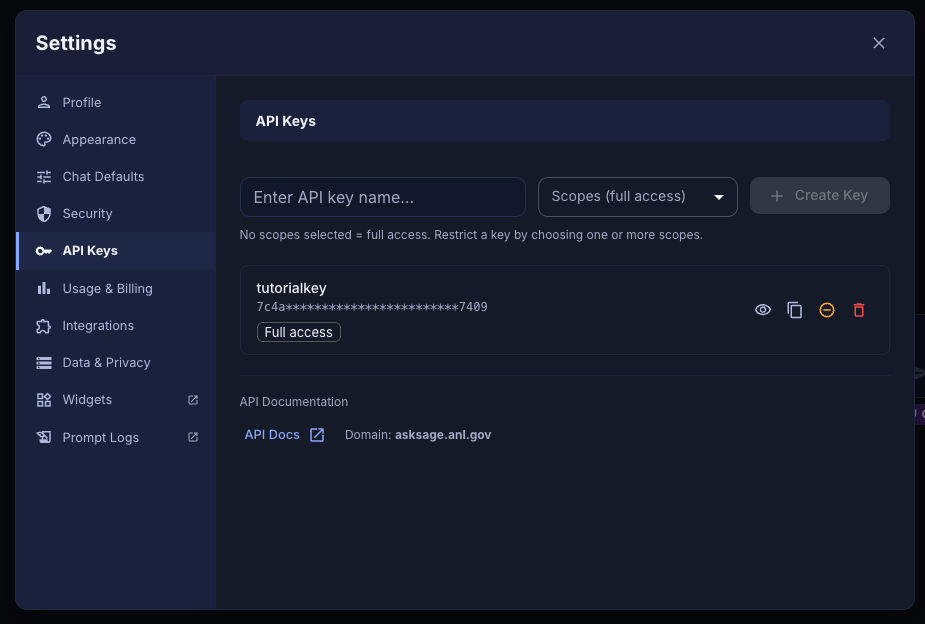

# Claude Code + Ask Sage

**Goal:** run [Claude Code](https://docs.anthropic.com/en/docs/claude-code/overview) against
**Ask Sage** as the inference backend. Ask Sage exposes an Anthropic-compatible Messages API
over HTTPS, so this works from anywhere — **no VPN or SSH tunnel needed** — as long as you have
an Ask Sage API key.

These docs use Argonne's **ANL-hosted Ask Sage instance**:

- Chat / key management UI: <https://chat.asksage.anl.gov/> (ANL SSO)
- API base URL: `https://api.asksage.anl.gov/server/anthropic`

This is the simplest of the four combinations: get a key from the ANL Ask Sage portal, point
Claude Code at the API base URL, and authenticate with that key.

> **No proxy/shim needed here.** The [argo-shim](https://github.com/n-getty/argo-shim) tool
> used in the [Code + Argo guide](claude-code-argo.md) is Argo-specific — it tunnels to
> `apps.inside.anl.gov`, injects the ALCF `user` field, and rewrites paths to `/argoapi/...`.
> Ask Sage is a plain HTTPS Anthropic-compatible endpoint, so Claude Code connects to it
> directly. Don't point argo-shim at Ask Sage.

---

## Prerequisites

- An **ANL account** with access to the ANL Ask Sage instance (you log in with ANL SSO).
- **Claude Code** installed: <https://docs.anthropic.com/en/docs/claude-code/overview>
- An **Ask Sage API key** — generate it in Step 1 below. Treat it like a password.

---

## Step 1 — Get your Ask Sage API key

The key is issued from the ANL Ask Sage web portal:

1. Go to **<https://chat.asksage.anl.gov/>**.
2. Log in with **ANL SSO**.
3. Click your **user profile** at the **bottom left** — this opens **Settings**.
4. In Settings, select the **API Keys** tab.
5. Type a name in **"Enter API key name…"** (e.g. `tutorialkey`). Leave the **Scopes** dropdown
   at its default — *no scopes selected = full access* — then click **+ Create Key**.
6. **Copy** the generated key (use the copy icon on the key's row).



Save the key somewhere safe — treat it like a password. It's the credential Claude Code will
use to authenticate. A convenient, git-safe place is a chmod-600 file:

```bash
mkdir -p ~/.config/asksage
umask 077 && printf '%s' 'PASTE_YOUR_KEY_HERE' > ~/.config/asksage/key
```

---

## Step 2 — Verify your key and the endpoint

Before wiring up Claude Code, confirm the endpoint is reachable and your key works:

```bash
curl -s https://api.asksage.anl.gov/server/anthropic/v1/models \
  -H "x-api-key: $(cat ~/.config/asksage/key)" | jq '.data[].id'
```

You should see a list including `claude-opus-4-8`, `claude-sonnet-5`, etc. A `401` means a bad
key; a `404` on the path means you're pointed at the wrong base URL.

---

## Step 3 — Launch Claude Code against Ask Sage

```bash
ANTHROPIC_BASE_URL="https://api.asksage.anl.gov/server/anthropic" \
ANTHROPIC_AUTH_TOKEN="$(cat ~/.config/asksage/key)" \
CLAUDE_CODE_SKIP_ANTHROPIC_AUTH=1 \
claude
```

- `ANTHROPIC_BASE_URL` — the ANL Ask Sage Anthropic-compatible root (**no trailing slash**).
- `ANTHROPIC_AUTH_TOKEN` — your **Ask Sage API key** (unlike Argo, this is a real secret).
- `CLAUDE_CODE_SKIP_ANTHROPIC_AUTH=1` — bypasses the normal claude.ai OAuth login.

> **Keep the key out of your shell history.** Load it from a file that isn't committed (as
> above), not as a literal on the command line.

### Convenience wrapper

A small launcher is included at [`scripts/asksage-claude.sh`](../scripts/asksage-claude.sh).
It reads your key from `ASKSAGE_API_KEY` (or `~/.config/asksage/key`) and launches Claude
Code wired to Ask Sage:

```bash
export ASKSAGE_API_KEY="$(cat ~/.config/asksage/key)"   # or just rely on the file
./scripts/asksage-claude.sh
```

---

## Step 4 — Pick a model

Inside Claude Code use `/model` and enter an Anthropic model ID, e.g.:

- `claude-sonnet-5` — fast, strong default for coding
- `claude-opus-4-8` — strongest for complex, multi-step agentic work

The exact list depends on what the ANL instance offers — run the Step 2 curl to see the current
set. See the [reference](reference.md#model-names-anthropic-ids) for more.

---

## Argo vs. Ask Sage for Claude Code — which to use?

| | **Argo** | **Ask Sage** |
|---|---|---|
| Works off-VPN from a laptop | Only via SSH tunnel + proxy (argo-shim) | ✅ Directly |
| Credential | ANL username (not secret) | Real API key (secret) |
| Requires DOO/AI-Rep approval | ✅ | ANL Ask Sage account (ANL SSO) |
| Also serves OpenAI/Gemini models | ✅ | Anthropic (Claude) only |
| Best when | You're on-network / on a login node | You want zero networking setup |

Both use the same three Claude Code environment variables — only `ANTHROPIC_BASE_URL` and the
token change.

---

## Troubleshooting

| Symptom | Likely cause | Fix |
|---|---|---|
| `401 Unauthorized` | Bad or missing key | Re-check `ANTHROPIC_AUTH_TOKEN`; regenerate the key at <https://chat.asksage.anl.gov/> and test with the Step 2 curl |
| `404` on `/v1/models` | Wrong base URL | Use `https://api.asksage.anl.gov/server/anthropic` (no trailing slash) |
| Model picker empty | Discovery failed | Verify key; confirm the base URL has no trailing slash |
| Claude.ai login screen appears | `CLAUDE_CODE_SKIP_ANTHROPIC_AUTH` not set | Add `CLAUDE_CODE_SKIP_ANTHROPIC_AUTH=1` |

---

**Next:** if you want the desktop app instead of the terminal, see
[Cowork + Ask Sage](claude-cowork-asksage.md).
